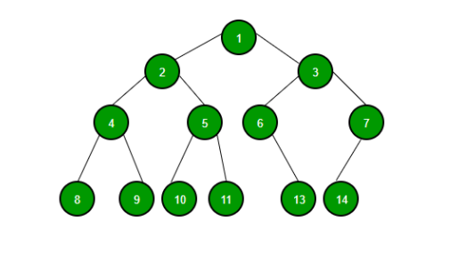

# Trees

- A tree whose elements have at most 2 children is called a binary tree. Since each element in a binary tree can have only 2 children, we typically name them the left and right child.

### A Binary Tree node contains following parts.

1. Data.
2. Pointer to left child.
3. Pointer to right child.

## Building trees
- The process of assembling a tree is similar to the process of assembling a linked list. Each constructor invocation builds a single node.

class Tree:

    def __init __(self, cargo, left=None, right=None):
        self.cargo = cargo
        self.left  = left
        self.right = right

    def __str__(self):
        return str(self.cargo)

The cargo can be any type, but the left and right parameters should be tree nodes. left and right are optional; the default value is None. To print a node, we just print the cargo.

## In-order Traversal
In this traversal method, the left subtree is visited first, then the root and later the right sub-tree. We should always remember that every node may represent a subtree itself.

If a binary tree is traversed in-order, the output will produce sorted key values in an ascending order.